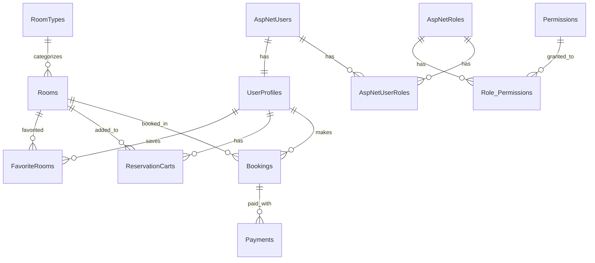

<div align="center">

# 🏨 Bookify Hotel — Secure Hotel Booking Platform

[](https://dotnet.microsoft.com/)
[](https://www.microsoft.com/sql-server)
[](https://www.docker.com/)
[](https://learn.microsoft.com/aspnet/core/security/authentication/identity)
[](https://stripe.com/)
[](LICENSE)

**A full-stack, security-hardened hotel reservation system built with ASP.NET Core MVC, featuring role-based access control, Stripe payment integration, and a fully containerized Docker deployment.**

[🚀 Quick Start](#-quick-start) · [🔒 Security Features](#-security-features) · [🏗️ Architecture](#️-architecture) · [📸 Demo](#-demo)

</div>

---

## 📸 Demo

### 🔐 Login & Authentication
The application features a secure login system with rate-limiting, account lockout protection, and default deny authorization policy.

### 🏠 Home Page
Browse available rooms with real-time availability, pricing, and filtering by room type.

### 📋 Admin Dashboard
Full CRUD operations for managing rooms, room types, users, bookings, and payments.

### 🛒 Booking Flow
Search → Select Room → Reserve → Checkout with Stripe → Booking Confirmation.

---

## 🚀 Quick Start

### Prerequisites
- [Docker Desktop](https://www.docker.com/products/docker-desktop/) installed and running

### One-Command Launch
```bash
# Clone the repository
git clone https://github.com/Abdo9tech/final_web_application_security.git
cd final_web_application_security

# Launch the entire stack (SQL Server + Web App + DB Admin)
docker compose up -d
```

Wait ~30 seconds, then open: **http://localhost:5280**

### Default Credentials

| Role | Email | Password |
|------|-------|----------|
| 👑 **Admin** | `admin@bookify.com` | `Admin@123456!` |
| 👤 **User** | `user@bookify.com` | `User@123456!` |

### Services

| Service | URL | Description |
|---------|-----|-------------|
| 🌐 **Web App** | http://localhost:5280 | Main Bookify application |
| 🗄️ **DB Admin** | http://localhost:8082 | Adminer database GUI |
| 🔌 **SQL Server** | `localhost:1433` | Direct SQL Server access |

---

## 🔒 Security Features

This project was built with a **Security-First** mindset as part of the **DEPI Web Application Security** course. Every layer includes hardened configurations:

### 🛡️ Authentication & Authorization
| Feature | Implementation |
|---------|---------------|
| **ASP.NET Core Identity** | Full user management with hashed passwords (PBKDF2) |
| **Role-Based Access Control (RBAC)** | Admin & User roles with separate permissions |
| **Default Deny Policy** | All endpoints require authentication by default |
| **Account Lockout** | Auto-lockout after 5 failed login attempts (15 min) |
| **Rate Limiting** | `LoginPolicy` — max 5 login requests per 15-minute window |
| **Strong Password Policy** | Min 8 chars, uppercase, lowercase, digit, special char |

### 🔐 Transport & Header Security
| Header | Value | Protection |
|--------|-------|------------|
| `X-Content-Type-Options` | `nosniff` | MIME-sniffing attacks |
| `X-Frame-Options` | `SAMEORIGIN` | Clickjacking |
| `X-XSS-Protection` | `1; mode=block` | Reflected XSS |
| `Content-Security-Policy` | Whitelisted sources | XSS, data injection |
| `Referrer-Policy` | `strict-origin-when-cross-origin` | Information leakage |
| `Permissions-Policy` | Disabled: camera, mic, geo | Excess permissions |
| **HSTS** | Enabled in production | Protocol downgrade |
| **HTTPS Redirection** | Forced | Unencrypted traffic |

### 🐳 Container Security
- **Non-root user**: App runs as `app` (UID 1000) inside the container
- **Data Protection keys**: Persisted to a dedicated Docker volume
- **Multi-stage build**: Only runtime binaries in the final image (no SDK/source code)
- **Health checks**: SQL Server readiness verification before app startup

---

## 🏗️ Architecture

### Tech Stack

| Layer | Technology |
|-------|-----------|
| **Frontend** | Razor Views (MVC), HTML5, CSS3, JavaScript |
| **Backend** | ASP.NET Core 9.0 MVC |
| **ORM** | Entity Framework Core 9.0 (Code-First + Lazy Loading) |
| **Database** | Microsoft SQL Server 2022 |
| **Authentication** | ASP.NET Core Identity |
| **Payments** | Stripe.net SDK |
| **Containerization** | Docker + Docker Compose |
| **CI/CD** | GitHub Actions (optional) |

### Project Structure

```
📦 final_web_application_security/
├── 📂 Project(DEPI)/           # Main Web Application (MVC)
│   ├── Controllers/            # MVC Controllers (Home, Login, Register, Admin, etc.)
│   ├── Views/                  # Razor Views (.cshtml)
│   ├── Migrations/             # EF Core Database Migrations
│   ├── ViewModels/             # Request/Response view models
│   ├── SecurityHeadersMiddleware.cs  # Custom security headers middleware
│   ├── StripeService.cs        # Stripe payment integration
│   └── Program.cs              # Application entry point & configuration
│
├── 📂 DAL/                     # Data Access Layer
│   ├── Model/                  # Entity models (Room, Booking, UserProfile, etc.)
│   └── DataBase/               # DbContext & Generic Repository pattern
│
├── 📂 PLL/                     # Presentation Logic Layer
│   └── Services/               # Business services (RoomService, BookingService)
│
├── 📂 SecurityReports/         # Penetration testing reports
├── 📂 SecurityTests/           # Security test configurations
│
├── 🐳 Dockerfile               # Multi-stage Docker build
├── 🐳 docker-compose.yml       # Full stack orchestration
├── 📄 HotelEcommerce.sln       # .NET Solution file
└── 📄 README.md                # This file
```

### Database Schema



---

## 📋 Features

### 👤 User Features
- 🔍 **Browse Rooms** — Search and filter available rooms by type, price, and capacity
- ❤️ **Favorites** — Save rooms to a personal favorites list
- 🛒 **Reservation Cart** — Add rooms with check-in/check-out dates
- 💳 **Stripe Checkout** — Secure payment processing
- 📋 **Booking History** — View past and upcoming reservations
- 👤 **Profile Management** — Update personal information and photo
- 📞 **Contact Form** — Submit inquiries to the hotel

### 👑 Admin Features
- 🏨 **Room Management** — Full CRUD for rooms and room types
- 📊 **Dashboard** — Overview of bookings, revenue, and occupancy
- 👥 **User Management** — View and manage registered users
- 📝 **Booking Management** — Approve, modify, or cancel bookings
- 💰 **Payment Tracking** — Monitor payment status and transactions
- 🔐 **Role & Permission Management** — Assign roles and granular permissions

---

## 🔧 Development Setup

### Running Locally (without Docker)

```bash
# 1. Ensure SQL Server is running locally
# 2. Update connection string in appsettings.json
# 3. Run the application
dotnet restore
dotnet ef database update --project "Project(DEPI)"
dotnet run --project "Project(DEPI)"
```

### Docker Commands

```bash
# Start the full stack
docker compose up -d

# Rebuild after code changes
docker compose down -v
docker compose build web
docker compose up -d

# View logs
docker compose logs -f web

# Stop everything
docker compose down

# Full reset (wipe database)
docker compose down -v
```

---

## 🧪 Security Testing

The project includes penetration testing configurations and reports:

- **OWASP ZAP** — Automated vulnerability scanning (`zap.yaml`)
- **Security Reports** — Documented findings in `SecurityReports/`
- **Pentest Documentation** — Detailed methodology in `Pentest.docx`

### Security Headers Verification

```bash
# Check security headers
curl -I http://localhost:5280
```

Expected headers:
```
X-Content-Type-Options: nosniff
X-Frame-Options: SAMEORIGIN
X-XSS-Protection: 1; mode=block
Referrer-Policy: strict-origin-when-cross-origin
Content-Security-Policy: default-src 'self'; ...
Permissions-Policy: geolocation=(), microphone=(), camera=(), payment=()
```

---

## 👥 Team

**DEPI — Digital Egypt Pioneers Initiative**  
Web Application Security Track

---

## 📄 License

This project is licensed under the MIT License — see the [LICENSE](LICENSE) file for details.

---

<div align="center">

**Built with ❤️ and 🔒 Security by the DEPI Team**

</div>
