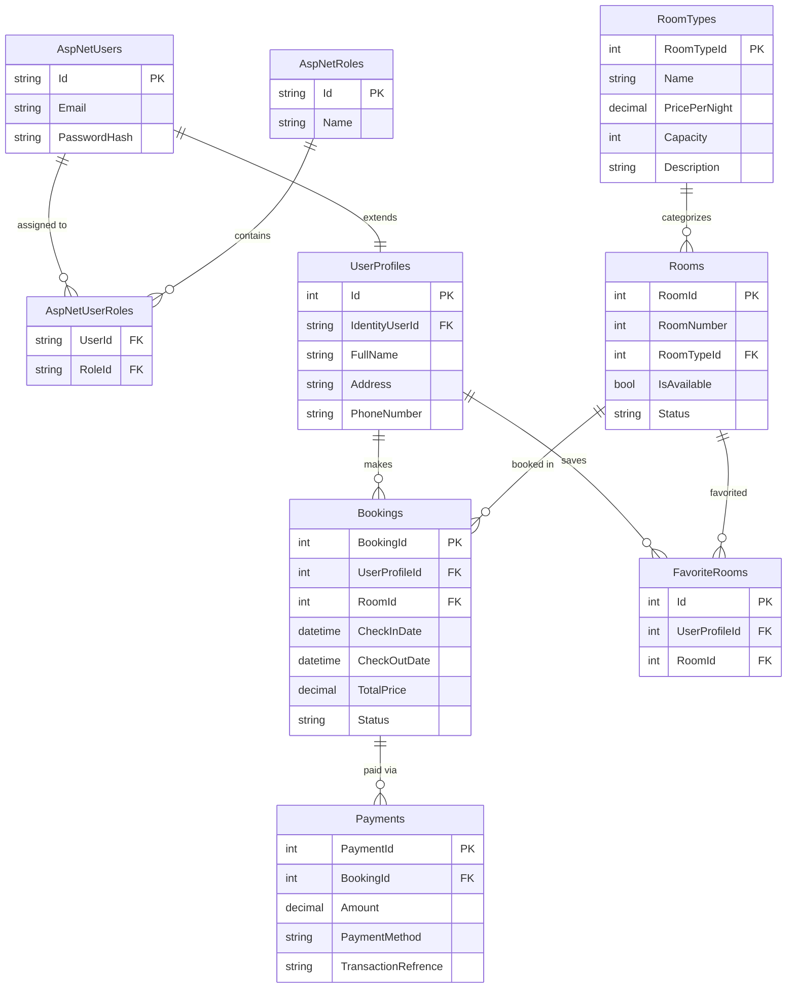

# 🗄️ Database Architecture & Details

This document provides a comprehensive overview of the database engine, ORM, schema, and connection details for the **Bookify Hotel** application.

---

## ⚙️ 1. Database Engine & Environment

- **Engine:** Microsoft SQL Server 2022 (Linux Container)
- **Image:** `mcr.microsoft.com/mssql/server:2022-latest`
- **Deployment:** Dockerized via `docker-compose.yml`
- **Data Persistence:** Stored in a Docker volume named `sqlserver-data` mapped to `/var/opt/mssql`. This ensures that your data is not lost when the container stops or restarts.

### Connection Details
- **Container Name:** `bookify-sqlserver`
- **Internal Port (Docker Network):** `1433`
- **External Port (Host Machine):** `1433`
- **Default Username:** `sa` (System Administrator)
- **Default Password:** `BookifyHotel@2024!`
- **Database Name:** `BookifyHotelDb`

### GUI Management (Adminer)
A lightweight database management GUI is included in the stack.
- **URL:** [http://localhost:8082](http://localhost:8082)
- **System:** `MS SQL`
- **Server:** `` (use the container name inside Docker)
- **Username:** `sa`
- **Password:** `BookifyHotel@2024!`
- **Database:** `BookifyHotelDb`

---

## 🌉 2. Object-Relational Mapping (ORM)

The application uses **Entity Framework Core (EF Core) 9.0** with the **Code-First** approach.

- **Context:** `BookifyHotelDbContext` (Located in `DAL/DataBase/BookifyHotelDbContext.cs`)
- **Migrations:** Handled automatically on startup. The app connects to the `master` database first to verify/create the `BookifyHotelDb`, then applies all pending EF migrations.
- **Lazy Loading:** Enabled via Microsoft.EntityFrameworkCore.Proxies (`.UseLazyLoadingProxies()`). This allows navigation properties (like `Room.RoomType`) to be loaded on-demand automatically.

---

## 📊 3. Database Schema & ER Diagram

The database uses ASP.NET Core Identity for authentication and custom tables for the hotel business logic.

### Core Tables:

| Table Name | Purpose | Key Relationships |
|------------|---------|-------------------|
| **AspNetUsers** | Identity table storing login credentials & emails. | 1:1 with `UserProfiles` |
| **AspNetRoles** | Stores RBAC roles (`Admin`, `User`). | M:N with `AspNetUsers` |
| **UserProfiles** | Custom profile data (Name, Phone, Address, Photo). | 1:N with `Bookings`, `FavoriteRooms` |
| **RoomTypes** | Categories of rooms (Standard, Deluxe, Suite, etc.) | 1:N with `Rooms` |
| **Rooms** | Individual physical rooms, availability, and images. | 1:N with `Bookings`, `FavoriteRooms` |
| **Bookings** | Reservation records including Check-In/Out dates. | 1:N with `Payments` |
| **Payments** | Stripe payment transactions linked to a booking. | Belongs to `Bookings` |
| **FavoriteRooms** | Wishlist system mapping Users to Rooms. | M:N map between Profile and Room |

### Entity Relationship (ER) Diagram



---

## 🔄 4. Automated Seeding

When the application starts up, the `Program.cs` file ensures the following data is seeded if the tables are empty:

1. **Default Roles:** `Admin`, `User`
2. **Default Users:** 
   - `admin@bookify.com` (Admin@123456!)
   - `user@bookify.com` (User@123456!)
3. **Room Types:** Standard (Capacity 2), Deluxe (Capacity 3), Suite (Capacity 5)
4. **Rooms:** 9 default rooms (3 of each type) populated with high-quality images from Unsplash.

## 🛠️ 5. Common EF Core Commands

If you need to make changes to the C# models, run these commands in your terminal (ensure you are inside the `Project(DEPI)` folder):

**Add a new migration:**
```powershell
dotnet ef migrations add NameOfYourMigration
```

**Remove the last migration (if not applied to DB yet):**
```powershell
dotnet ef migrations remove
```

**Manually update database (outside of Docker):**
```powershell
dotnet ef database update
```
